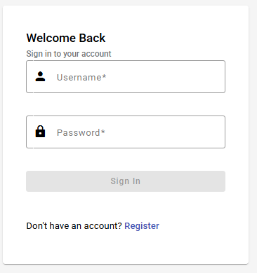
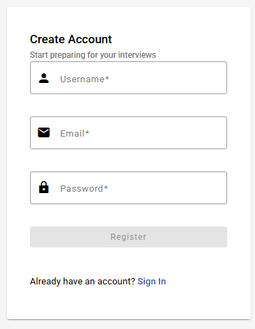
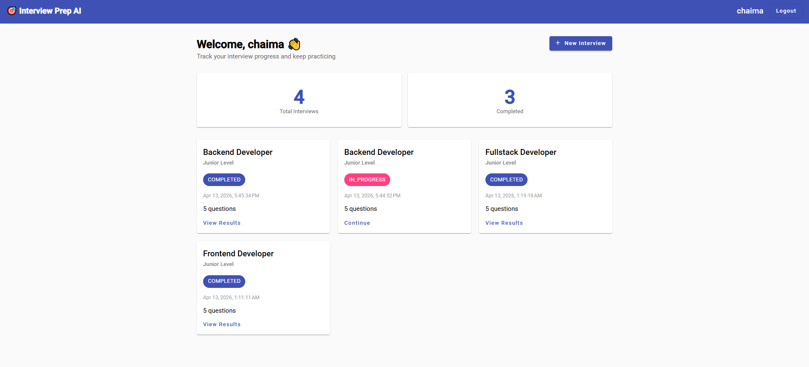
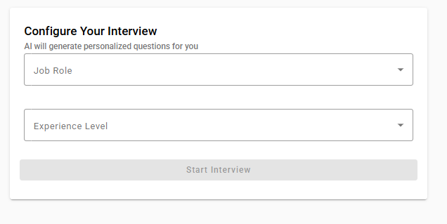
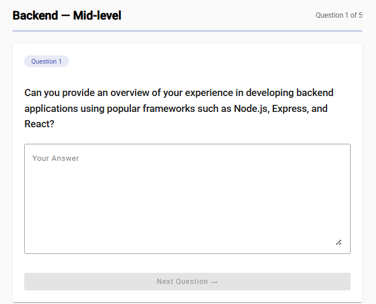
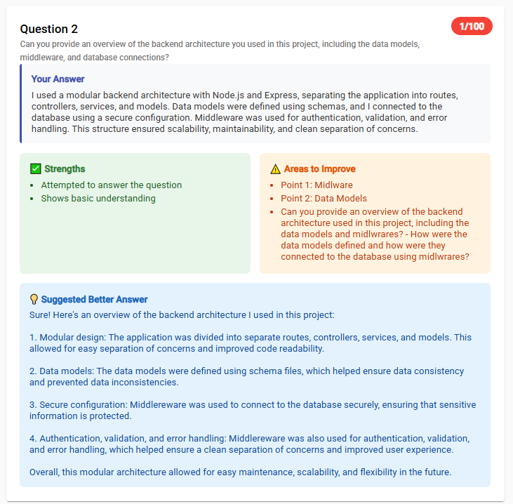

<div align="center">

# 🎯 AI Interview Preparation Platform

### A full-stack web application that simulates technical interviews and delivers AI-powered feedback

[](https://spring.io/projects/spring-boot)
[](https://angular.io)
[](https://www.mysql.com)
[](https://ollama.ai)
[](https://jwt.io)

[Features](#-features) • [Screenshots](#-screenshots) • [Architecture](#-architecture) • [Getting Started](#-getting-started) • [API](#-api-documentation)

</div>

---

## 📌 About The Project

This platform helps developers prepare for technical interviews by simulating real interview sessions and providing instant AI-powered feedback. Users select their job role and experience level, answer AI-generated questions, and receive detailed scores, strengths, weaknesses, and improved answers — all running **100% locally** with no external API costs.

### 🔑 Key Highlights

- **100% Free & Local** — Uses Ollama (local LLM) with no API keys or cloud costs
- **JWT Security** — Stateless authentication with protected REST endpoints
- **Clean Architecture** — Proper layered backend (Controller → Service → Repository)
- **Modern Frontend** — Angular 18 standalone components with new control flow syntax
- **Real AI Feedback** — Dynamic question generation and answer evaluation per role

---

## ✨ Features

| Feature | Description |
|---------|-------------|
| 🔐 Authentication | Register & login with JWT tokens |
| 🎭 Role Selection | Frontend, Backend, or Fullstack interviews |
| 🤖 AI Questions | Dynamically generated questions via local LLM |
| 📝 Answer Submission | Submit and store answers per interview session |
| 📊 AI Feedback | Score (0–100), strengths, weaknesses, improved answer |
| 📈 Dashboard | View all past interviews and track progress |

---

## 🖥️ Screenshots

## 🖥️ Screenshots

| Login | Register | Dashboard |
|-------|----------|-----------|
|  |  |  |

| Interview | Question | Feedback |
|-----------|----------|----------|
|  |  |  |
---

## 🏗️ Architecture

```
┌─────────────────┐         ┌──────────────────┐         ┌─────────────┐
│  Angular 18     │  HTTP   │  Spring Boot 3.5  │   JPA   │   MySQL     │
│  (Port 4200)    │◄───────►│  (Port 8080)      │◄───────►│  (Port 3306)│
│                 │   JWT   │                   │         │             │
└─────────────────┘         └────────┬─────────┘         └─────────────┘
                                     │ REST
                                     ▼
                            ┌──────────────────┐
                            │  Ollama (Local)   │
                            │  tinyllama model  │
                            │  (Port 11434)     │
                            └──────────────────┘
```

### Backend Structure
```
src/main/java/com/interview/platform/
├── config/          # Security & CORS configuration
├── controller/      # REST API endpoints
├── dto/             # Data Transfer Objects
├── entity/          # JPA entities
├── repository/      # Spring Data JPA repositories
├── security/        # JWT filter & utilities
└── service/         # Business logic + Ollama integration
```

### Database Schema
```
users ──< interviews ──< questions
                    └──< answers ──< feedbacks
```

---

## 🛠️ Tech Stack

### Backend
- **Java 17** + **Spring Boot 3.5**
- **Spring Security** — JWT-based stateless auth
- **Spring Data JPA** + **Hibernate** — ORM
- **MySQL** — Relational database (via XAMPP)
- **Ollama REST API** — Local AI integration

### Frontend
- **Angular 18** — Standalone components, new `@if`/`@for` control flow
- **Angular Material** — UI component library
- **RxJS** — Reactive HTTP calls
- **Functional Guards & Interceptors** — Modern Angular patterns

---

## 🚀 Getting Started

### Prerequisites

| Tool | Version | Download |
|------|---------|----------|
| Java | 17+ | [Download](https://adoptium.net) |
| Node.js | 18+ | [Download](https://nodejs.org) |
| XAMPP | Latest | [Download](https://www.apachefriends.org) |
| Ollama | Latest | [Download](https://ollama.ai) |

### 1. Clone the repository

```bash
git clone https://github.com/chaimamogaadi/ai-interview-prep-platform.git
cd ai-interview-prep-platform
```

### 2. Setup the database

1. Start XAMPP and enable **Apache** + **MySQL**
2. Open `http://localhost/phpmyadmin`
3. Create a database named `interview_db`
4. Run the SQL script:

```bash
mysql -u root -p interview_db < docs/database/schema.sql
```

### 3. Setup Ollama (Local AI)

```bash
# Pull the AI model (only once)
ollama pull tinyllama

# Verify it's running
curl http://localhost:11434
# Should return: Ollama is running
```

### 4. Run the backend

```bash
cd backend
mvn spring-boot:run
```

Backend runs at `http://localhost:8080`

### 5. Run the frontend

```bash
cd frontend
npm install
ng serve
```

Frontend runs at `http://localhost:4200`

---

## 📡 API Documentation

### Authentication

| Method | Endpoint | Description | Auth |
|--------|----------|-------------|------|
| POST | `/api/auth/register` | Register new user | ❌ |
| POST | `/api/auth/login` | Login & get JWT token | ❌ |

### Interview

| Method | Endpoint | Description | Auth |
|--------|----------|-------------|------|
| POST | `/api/interview/start` | Start new interview session | ✅ |
| GET | `/api/interview` | Get all user interviews | ✅ |
| GET | `/api/interview/{id}` | Get interview by ID | ✅ |
| PUT | `/api/interview/{id}/complete` | Mark interview as complete | ✅ |

### Answers & Feedback

| Method | Endpoint | Description | Auth |
|--------|----------|-------------|------|
| POST | `/api/answer/submit` | Submit an answer | ✅ |
| GET | `/api/answer/interview/{id}` | Get answers for interview | ✅ |
| POST | `/api/feedback/generate/{answerId}` | Generate AI feedback | ✅ |
| GET | `/api/feedback/interview/{id}` | Get all feedbacks | ✅ |

### Example: Login Request
```json
POST /api/auth/login
{
  "username": "john",
  "password": "secret123"
}
```

### Example: Feedback Response
```json
{
  "score": 78,
  "strengths": ["Good understanding of core concepts", "Practical example provided"],
  "weaknesses": ["Missing mention of edge cases", "Could elaborate on performance"],
  "improvedAnswer": "A more complete answer would also cover..."
}
```

---

## 📁 Project Structure

```
ai-interview-prep-platform/
├── backend/                  # Spring Boot application
│   ├── src/
│   └── pom.xml
├── frontend/                 # Angular 18 application
│   ├── src/
│   └── package.json
├── docs/
│   ├── database/
│   │   └── schema.sql        # Database setup script
│   └── screenshots/          # App screenshots
└── README.md
```

---

## 🔧 Configuration

### Backend (`backend/src/main/resources/application.properties`)
```properties
spring.datasource.url=jdbc:mysql://localhost:3306/interview_db
spring.datasource.username=root
spring.datasource.password=

ollama.url=http://localhost:11434/api/generate
ollama.model=tinyllama
```

---

## 🤝 Contributing

Contributions are welcome! Please feel free to submit a Pull Request.

1. Fork the project
2. Create your feature branch (`git checkout -b feature/AmazingFeature`)
3. Commit your changes (`git commit -m 'feat: add AmazingFeature'`)
4. Push to the branch (`git push origin feature/AmazingFeature`)
5. Open a Pull Request

---

## 📄 License

Distributed under the MIT License.

---

## 👩‍💻 Author

**Chaima Mogaadi**
- LinkedIn: [linkedin.com/in/chaima-mogaadi](https://linkedin.com/in/chaima-mogaadi)
- GitHub: [@chaimamogaadi](https://github.com/chaimamogaadi)
- Email: chaima.mogaaadi@gmail.com

---

<div align="center">
  <sub>Built with ❤️ using Spring Boot, Angular 18, and local AI</sub>
</div>